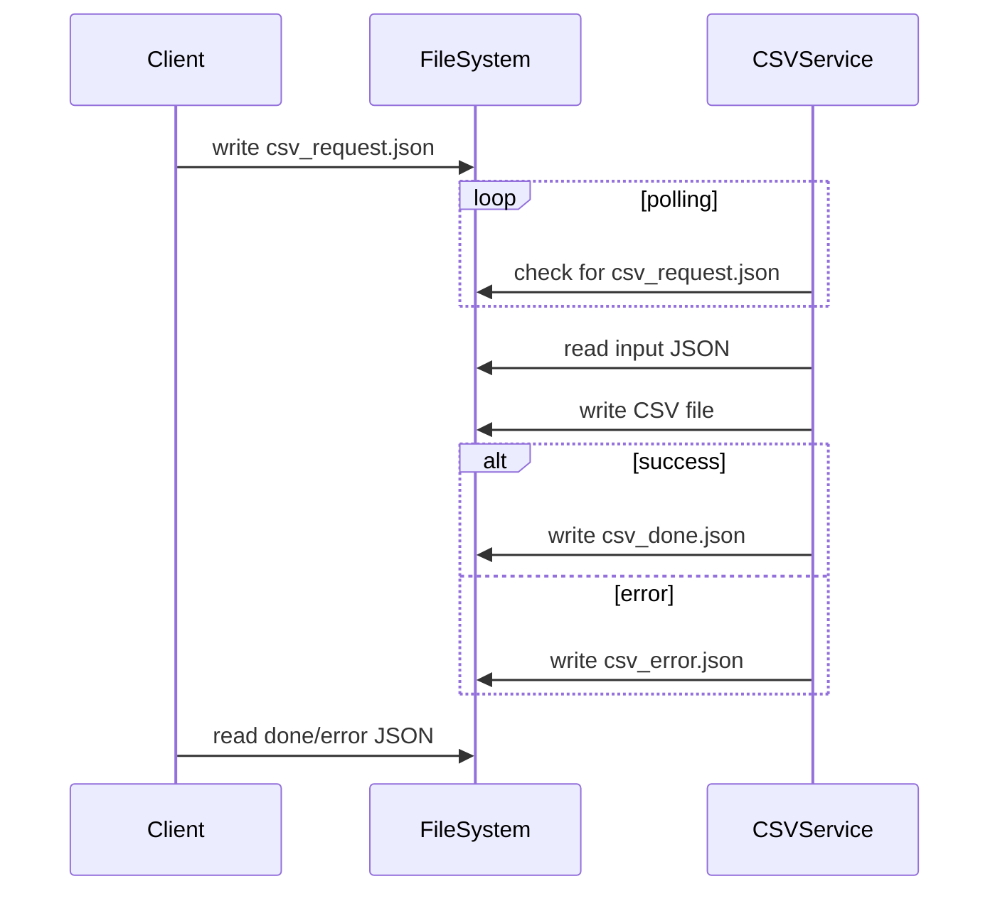

# CSV Converter Microservice

## Overview

The CSV Converter microservice converts JSON data into a CSV file based on a requested column list.

It supports:
- Custom column ordering
- Missing keys → blank cells
- Optional flattening for nested JSON
- Nested arrays → stored as JSON string in the CSV cell

This microservice uses **file-based JSON request/response communication**.

Once defined, this communication contract will NOT change.

---

# Communication Contract

## How to REQUEST Data

### Request File Name

The consuming program MUST create:

```
csv_request.json
```

---

### Required Fields

- `inputJsonPath` (string) – Path to input JSON file
- `outputCsvPath` (string) – Where CSV will be written
- `columns` (array of strings) – Column names and order for CSV header
- `flatten` (boolean) – If true, nested keys become `parent.child`

---

### Example Request

```json
{
  "inputJsonPath": "data/purchases.json",
  "outputCsvPath": "exports/purchases.csv",
  "columns": ["date","category","price","note","payload.category"],
  "flatten": true
}
```

---

### Example Programmatic Request (Python)

```python
import json
import os
import time

# Remove old response files
for f in ["csv_done.json", "csv_error.json"]:
    if os.path.exists(f):
        os.remove(f)

request = {
    "inputJsonPath": "test_client/sample_input.json",
    "outputCsvPath": "exports/output.csv",
    "columns": ["date","category","price","note"],
    "flatten": True
}

with open("csv_request.json", "w", encoding="utf-8") as f:
    json.dump(request, f, indent=2)

# Wait for response
while not (os.path.exists("csv_done.json") or os.path.exists("csv_error.json")):
    time.sleep(0.1)
```

---

# How to RECEIVE Data

After processing, the microservice writes exactly ONE of:

- `csv_done.json` (success)
- `csv_error.json` (failure)

---

## Success Response File

File:
```
csv_done.json
```

Example:

```json
{
  "status": "ok",
  "outputCsvPath": "exports/output.csv",
  "rowsWritten": 2
}
```

Fields:
- `status` → "ok"
- `outputCsvPath` → location of CSV
- `rowsWritten` → number of data rows written

---

## Error Response File

File:
```
csv_error.json
```

Example:

```json
{
  "status": "error",
  "message": "columns cannot be empty."
}
```

Possible Errors:
- Missing required fields
- Invalid JSON
- Input file does not exist
- `columns` is empty
- `flatten` is not boolean

---

## Example Programmatic Receive (Python)

```python
import json
import os

if os.path.exists("csv_done.json"):
    done = json.load(open("csv_done.json", "r", encoding="utf-8"))
    print("CSV created at:", done["outputCsvPath"])
    print("Rows written:", done["rowsWritten"])
else:
    err = json.load(open("csv_error.json", "r", encoding="utf-8"))
    print("Conversion failed:", err["message"])
```

---

# CSV Output Rules

- Header row is exactly the `columns` list provided.
- Missing keys become blank cells.
- If `flatten` is true:
  - Nested objects become `parent.child`
  - Arrays become JSON strings inside the cell.
- Standard comma-separated CSV format.

---

# Files Used

- `csv_request.json` → request file
- `csv_done.json` → success response
- `csv_error.json` → error response
- Output CSV → written to `outputCsvPath`

The microservice NEVER directly calls the consuming program.  
All communication is done through files only.

---

# UML Sequence Diagram


